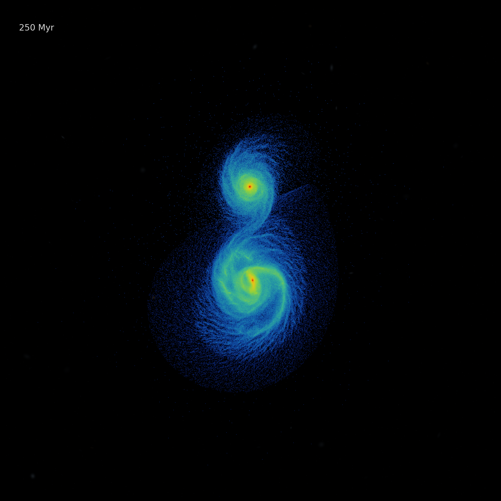

# galaxy-merger



GPU-accelerated N-body galaxy merger simulation. Barnes-Hut tree gravity with leapfrog integration, running on CUDA. Currently gravity-only with collisionless components, hydrodynamics and star formation are next. Work in progress.

Two disk galaxies on a parabolic encounter orbit, each with a dark matter halo (Hernquist profile), stellar disk (exponential + sech^2), stellar bulge, gas disk, and a central black hole. Initial conditions are generated with proper equilibrium velocities from the Jeans equations so each galaxy is independently stable before the interaction begins.

The simulation uses a Barnes-Hut octree built on CPU and force evaluation on GPU. A kick-drift-kick leapfrog integrator advances the system. Snapshots are dumped as binary files for post-processing and rendering.

3 million particles, 1.2 billion years of evolution, runs in about 1 hour on an colab.

## structure

```
src/gravity.cu      barnes-hut tree + GPU force kernel
src/main.cu         integrator, snapshot IO, main loop
include/            header with constants and types
generate_ics.py     initial conditions generator
analysis.py         snapshot reader
```

## running it

needs CUDA and an nvidia GPU.

```bash
# compile (change sm_80 to match your GPU)
nvcc -O3 -arch=sm_80 -Iinclude src/gravity.cu src/main.cu -o galaxy_merger

# generate initial conditions
pip install numpy scipy
python generate_ics.py --N 3000000 --output ic.bin --separation 100 --pericenter 20

# run (1.2 Gyr, snapshots every 5 Myr, timestep 0.5 Myr)
./galaxy_merger ic.bin snapshots 1.2 0.005 0.0005
```

## units

everything is in kpc, 10^10 solar masses, and km/s. gravitational constant G = 43007 in these units. one internal time unit is 0.978 Gyr.

## physics

- dark matter halos: Hernquist profile, velocities from the spherical Jeans equation
- stellar disks: exponential surface density with sech^2 vertical profile, velocities from the epicyclic approximation with Toomre Q ~ 1.3
- bulges: Hernquist profile with Eddington inversion velocities
- gas disks: exponential, circular orbits (collisionless for now)
- gravity: Barnes-Hut octree, opening angle theta = 0.7, Plummer softening (100 pc for dark matter, 50 pc for stars)
- integration: symplectic kick-drift-kick leapfrog, fixed timestep
- encounter orbit: parabolic, prograde, 20 degree inclination

## Incoming

- SPH hydrodynamics (written but the neighbor grid needs fixing)
- radiative cooling
- star formation and feedback
- adaptive timestepping
- GPU tree construction (currently CPU-bound at high N)

## note
Still experimenting with proper initial conditions to get something like M51, also restructuring the particle storage to use a morton curve sorted layout and building the octree directly on the GPU would make the whole pipeline GPU-bound and bring a significant speedup.
